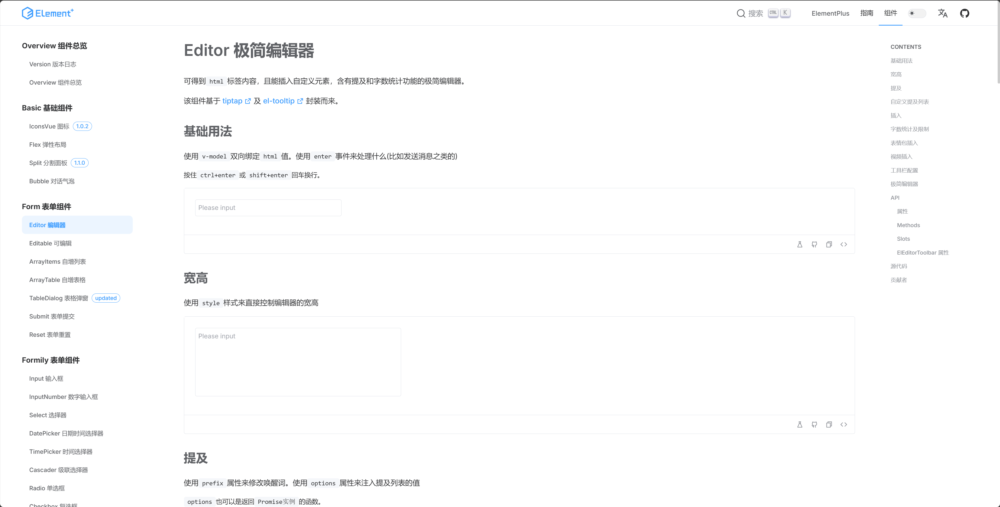

<p align="center">
  
</p>

<p align="center">
  <a href="https://www.npmjs.org/package/element-plus">
    
  </a>
  <a href="https://github.com/element-plus/element-plus">
    
  </a>
  <a href="https://npmcharts.com/compare/element-plus?minimal=true">
    
  </a>
  <a href="https://codecov.io/gh/element-plus/element-plus">
    
  </a>
  <br>
</p>

<p align="center">基于 Element Plus 拓展的  Element Plus X 组件库</p>

> element-plus-x 组件

#### 目前包含:

IconsVue 图标组件

Flex 弹性布局

Split 分割面板

Bubble 对话气泡

Editor 极简编辑器

Editable 可编辑

ArrayItems 自增列表

ArrayTable 自增表格

TableDialog 表格弹窗

Submit 表单提交

Reset 表单重置

Formily 表单组件(10 多个表单组件，支持配置渲染)

List 列表

VirtualList 虚拟列表

SortableList 可排序列表

CollapseContent 折叠内容

TablePage 表格页

DraggableTable 可拖拽表格

Ellipsis 省略

TextEllipsis 文本省略

Contextmenu 右键菜单

Dot 点

LoadMore 加载更多

DropdownV2 下拉菜单

Renderer 渲染器

FullScreen 全屏

Emoji 表情包

等其他业务组件，以上均是 element-plus 不具备的组件。

> 下面是文档图

因为 element-plus-x 域名已被占用,所以暂时不准备提供在线文档地址，需要自己本地启动。

其实该项目是在去年 7 月份已经开发了，只是一直在 gitee 维护，现在挪到 github 来继续开发及维护，里面借鉴了很多 ui 组件库代码的实现。

因为项目开发中 element-plus ui 库是必备的，所以就衍生出这个组件库。





## 安装

node 版本: 18.19.1; npm 版本: 10.2.4; pnpm 版本: 9.3.0

```js
pnpm install
```

## 本地调试

```js
npm run dev
```

## 创建新组件

```js
// test为组件名
npm run gen test
```

## 源代码构建

```js
npm run build
```

## 文档调试

```js
npm run docs:dev
```

## 文档构建

```js
npm run docs:build
```
